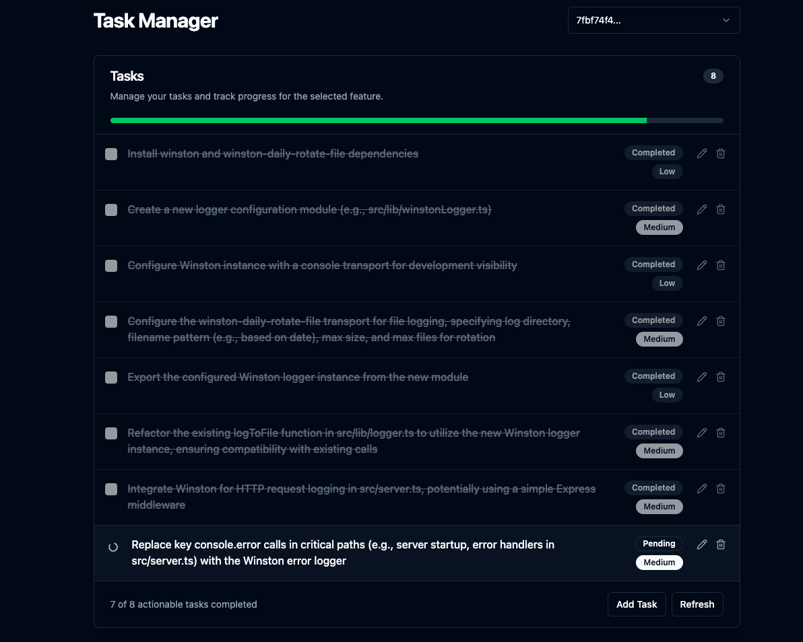

# Task Manager MCP Server

This is an MCP server built to integrate with AI code editors like Cursor. The main goal here is to maximize Cursor's agentic capabilities and Gemini 2.5's excellent architecting capabilities while working around Cursor's extremely limited context window. This was inspired largely by Roo Code's Boomerang mode, but I found it extremely expensive as the only model that works with it's apply bot is Claude 3.7 Sonnet. With this server, you get the best of both worlds: unlimited context window and unlimited usage for the price of Cursor's $20/month subscription.

In addition, it includes a Svelte UI that allows you to view the task list and progress, manually adjust the plan, and review the changes.

## Svelte UI



## Core Features

- **Complex Feature Planning:** Give it a feature description, and it uses an LLM with project context via `repomix` to generate a step-by-step coding plan for the AI agent to follow with recursive task breakdown for high-effort tasks.
- **Integrated UI Server:** Runs an Express server to serve static frontend files and provides basic API endpoints for the UI. Opens the UI in the default browser after planning is complete or when clarification is needed and displays the task list and progress.
- **Unlimited Context Window:** Uses Gemini 2.5's 1 million token context window with `repomix`'s truncation when needed.
- **Conversation History:** Keeps track of the conversation history for each feature in a separate JSON file within `.mcp/features/` for each feature, allowing Gemini 2.5 to have context when the user asks for adjustments to the plan.
- **Clarification Workflow:** Handles cases where the LLM needs more info, pausing planning and interacting with a connected UI via WebSockets.
- **Task CRUD:** Allows for creating, reading, updating, and deleting tasks via the UI.
- **Code Review:** Analyzes `git diff HEAD` output using an LLM and creates new tasks if needed.
- **Plan Adjustment:** Allows for adjusting the plan after it's created via the `adjust_plan` tool.

## Setup

### Prerequisites:

- Node.js
- npm
- Git

### Installation & Build:

1. **Clone:**

   ```bash
   git clone https://github.com/jhawkins11/task-manager-mcp.git
   cd task-manager-mcp
   ```

2. **Install Backend Deps:**

   ```bash
   npm install
   ```

3. **Configure:** You'll configure API keys later directly in Cursor's MCP settings (see Usage section), but you might still want a local `.env` file for manual testing (see Configuration section).

4. **Build:** This command builds the backend and frontend servers and copies the Svelte UI to the `dist/frontend-ui/` directory.
   ```bash
   npm run build
   ```

### Running the Server (Manually):

For local testing _without_ Cursor, you can run the server using Node directly or the npm script. This method **will** use the `.env` file for configuration.

**Using Node directly (use absolute path):**

```bash
node /full/path/to/your/task-manager-mcp/dist/server.js
```

**Using npm start:**

```bash
npm start
```

This starts the MCP server (stdio), WebSocket server, and the HTTP server for the UI. The UI should be accessible at http://localhost:<UI_PORT> (default 3000).

### Configuration (.env file for Manual Running):

If running manually (not via Cursor), create a .env file in the project root for API keys and ports. Note: When running via Cursor, these should be set in Cursor's mcp.json configuration instead (see Usage section).

```bash
# .env - USED ONLY FOR MANUAL `npm start` or `node dist/server.js`
# === OpenRouter (Recommended) ===

# Get key: https://openrouter.ai/keys
OPENROUTER_API_KEY=sk-or-v1-xxxxxxxxxxxxxxxxxxxxxxxxxxxxxxxxxxxxxxxxxxxxxxxx
OPENROUTER_MODEL=google/gemini-2.5-pro-exp-03-25:free
FALLBACK_OPENROUTER_MODEL=google/gemini-2.5-flash-preview:thinking

# === Google AI API (Alternative) ===
# GEMINI_API_KEY=your_google_ai_api_key
# GEMINI_MODEL=gemini-1.5-flash-latest
# FALLBACK_GEMINI_MODEL=gemini-1.5-flash-latest

# === UI / WebSocket Ports ===
# Default is 4999 if not set.
UI_PORT=4999
WS_PORT=4999

# === Auto Review ===
# If true, the agent will automatically run the 'review' tool after the last task is completed.
# Defaults to false.
AUTO_REVIEW_ON_COMPLETION=false
```

## Avoiding Costs

**IMPORTANT:** It's highly recommended to integrate your own Google AI API key to OpenRouter to avoid the free models' rate limits. See below.

**Using OpenRouter's Free Tiers:** You can significantly minimize or eliminate costs by using models marked as "Free" on OpenRouter (like google/gemini-2.5-pro-exp-03-25:free at the time of writing) while connecting your own Google AI API key. Check out this reddit thread for more info: https://www.reddit.com/r/ChatGPTCoding/comments/1jrp1tj/a_simple_guide_to_setting_up_gemini_25_pro_free/

**Fallback Costs:** The server automatically retries with a fallback model if the primary hits a rate limit. The default fallback (FALLBACK_OPENROUTER_MODEL) is often a faster/cheaper model like Gemini Flash, which might still have associated costs depending on OpenRouter's current pricing/tiers. Check their site and adjust the fallback model in your configuration if needed.

## Usage with Cursor (Task Manager Mode)

This is the primary way this server is intended to be used.

### 1. Configure the MCP Server in Cursor:

After building the server (`npm run build`), you need to tell Cursor how to run it.

Find Cursor's MCP configuration file. This can be:

- **Project-specific:** Create/edit a file at `.cursor/mcp.json` inside your project's root directory.
- **Global:** Create/edit a file at `~/.cursor/mcp.json` in your user home directory (for use across all projects).

Add the following entry to the mcpServers object within that JSON file:

```json
{
  "mcpServers": {
    "task-manager-mcp": {
      "command": "node",
      "args": ["/full/path/to/your/task-manager-mcp/dist/server.js"],
      "env": {
        "OPENROUTER_API_KEY": "sk-or-v1-xxxxxxxxxxxxxxxxxxxx"
        //   optional: my recommended model for MCP is Gemini 2.5 Pro Free which is already set by default
        //   "OPENROUTER_MODEL": "google/gemini-2.5-pro-exp-03-25:free",
        //   also optional
        //   "FALLBACK_OPENROUTER_MODEL": "google/gemini-2.5-flash-preview:thinking",
        //   optional: the default port for the UI is 4999 if not set
        //   "UI_PORT": "4999",
        //   optional: the default port for the WebSocket server is 4999 if not set
        //   "WS_PORT": "4999"
        // Add GEMINI_API_KEY here instead if using Google directly
        // Add any other necessary env vars here
      }
    }
    // Add other MCP servers here if you have them
  }
}
```

**IMPORTANT:**

- Replace `/full/path/to/your/task-manager-mcp/dist/server.js` with the absolute path to the compiled server script on your machine.
- Replace `sk-or-v1-xxxxxxxxxxxxxxxxxxxx` with your actual OpenRouter API key (or set GEMINI_API_KEY if using Google AI directly).
- These env variables defined here will be passed to the server process when Cursor starts it, overriding any `.env` file.

### 2. Create a Custom Cursor Mode:

1. Go to Cursor Settings -> Features -> Chat -> Enable Custom modes.
2. Go back to the chat view, click the mode selector (bottom left), and click Add custom mode.
3. Give it a name (e.g., "MCP Planner", "Task Dev"), choose an icon/shortcut.
4. Enable Tools: Make sure the tools exposed by this server (`plan_feature`, `mark_task_complete`, `get_next_task`, `review_changes`, `adjust_plan`) are available and enabled for this mode. You might want to enable other tools like Codebase, Terminal, etc., depending on your workflow.
5. Recommended Instructions for Agent: Paste these rules exactly into the "Custom Instructions" text box:

```
Always use plan_feature mcp tool when getting feature request before doing anything else. ALWAYS!!!!!!!! It will return the first step of the implementation. DO NOT IMPLEMENT MORE THAN WHAT THE TASK STATES. After you're done run mark_task_complete which will give you the next task. If the user says "review" use the review_changes tool. The review_changes tool will generate new tasks for you to follow, just like plan_feature. After a review, follow the same one-at-a-time task completion workflow: complete each review-generated task, mark it complete, and call get_next_task until all are done.

If clarification is required at any step, you will not receive the next task and will have to run get_next_task manually after the user answers the clarification question through the UI.

IMPORTANT: Your job is to complete the tasks one at a time. DO NOT DO ANY OTHER CHANGES, ONLY WHAT THE CURRENT TASK SAYS TO DO.
```

6. Save the custom mode.

## Expected Workflow (Using the Custom Mode):

1. Select your new custom mode in Cursor.
2. Give Cursor a feature request (e.g., "add auth using JWT").
3. Cursor, following the instructions, will call the `plan_feature` tool.
4. The server plans, saves data, and returns a JSON response (inside the text content) to Cursor.
   - If successful: The response includes `status: "completed"` and the description of the first task in the `message` field. The UI (if running) is launched/updated.
   - If clarification needed: The response includes `status: "awaiting_clarification"`, the `featureId`, the `uiUrl`, and instructions for the agent to wait and call `get_next_task` later. The UI is launched/updated with the question.
5. Cursor implements only the task described (if provided).
6. If clarification was needed, the user answers in the UI, the server resumes planning, and updates the UI via WebSocket. The agent, following instructions, then calls `get_next_task` with the `featureId`.
7. If a task was completed, Cursor calls `mark_task_complete` (with `taskId` and `featureId`).
8. The server marks the task done and returns the next pending task in the response message.
9. Cursor repeats steps 4-8.
10. If the user asks Cursor to "review", it calls `review_changes`.

## API Endpoints (for UI)

The integrated Express server provides these basic endpoints for the frontend:

- `GET /api/features`: Returns a list of existing feature IDs.
- `GET /api/tasks/:featureId`: Returns the list of tasks for a specific feature.
- `GET /api/tasks`: Returns tasks for the most recently created/modified feature.
- `GET /api/features/:featureId/pending-question`: Checks if there's an active clarification question for the feature.
- `POST /api/tasks`: Creates a new task for a feature.
- `PUT /api/tasks/:taskId`: Updates an existing task.
- `DELETE /api/tasks/:taskId`: Deletes a task.
- _(Static Files)_: Serves files from `dist/frontend-ui/` (e.g., `index.html`).
